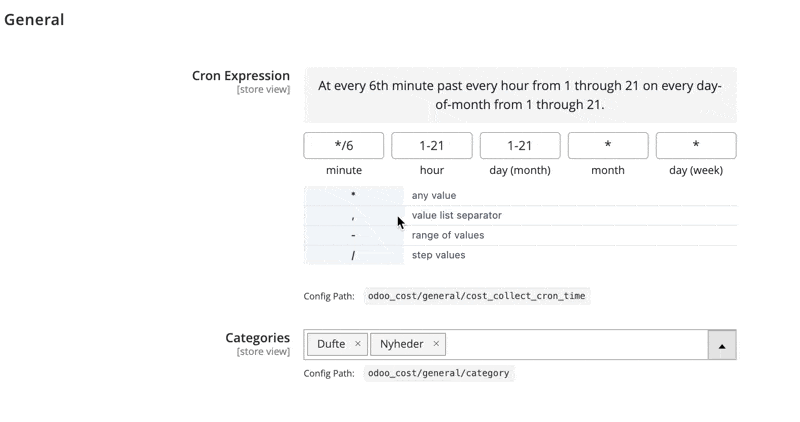

# Magento 2 Stores Configuration Elements Fields

A Magento 2 module that provides enhanced UI elements for the Stores > Configuration section, including a user-friendly cron expression editor field.

## Features
- **Cron Expression Editor**: Interactive, validated, and human-readable cron field for system configuration.
- Modern UI/UX with real-time validation and summary.

## Installation
### Via Composer

```bash
composer require hryvinskyi/magento2-configuration-fields
bin/magento module:enable Hryvinskyi_ConfigurationFields
bin/magento setup:upgrade
```

### Manual Installation
1. Copy the module to `app/code/Hryvinskyi/ConfigurationFields`.
2. Run the following Magento CLI commands:
   ```bash
   bin/magento setup:upgrade
   bin/magento setup:di:compile
   bin/magento cache:flush
   ```
   
## How It Works
- The module adds a new system configuration field type that renders a cron editor UI.
- The editor provides validation, error highlighting, and a summary of the cron schedule.
- The value is stored as a standard cron expression string.

## Example system.xml Usage
```
<field id="expression" translate="label" type="text" sortOrder="10" showInDefault="1" showInWebsite="1" showInStore="1">
    <label>Cron Expression</label>
    <frontend_model>Hryvinskyi\ConfigurationFields\Block\Adminhtml\System\Config\Form\Field\CronEditor</frontend_model>
</field>
```

## Screenshots


## Support

For issues, questions or contributions, please contact the author or create an issue in the GitHub repository.

## Author

- **Volodymyr Hryvinskyi**
- Email: volodymyr@hryvinskyi.com
- GitHub: https://github.com/hryvinskyi

## License

This project is licensed under the MIT License.
